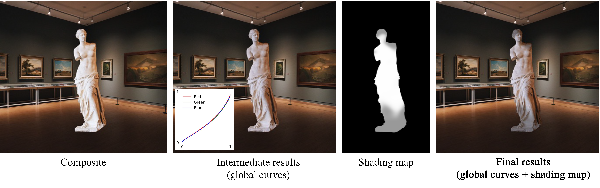
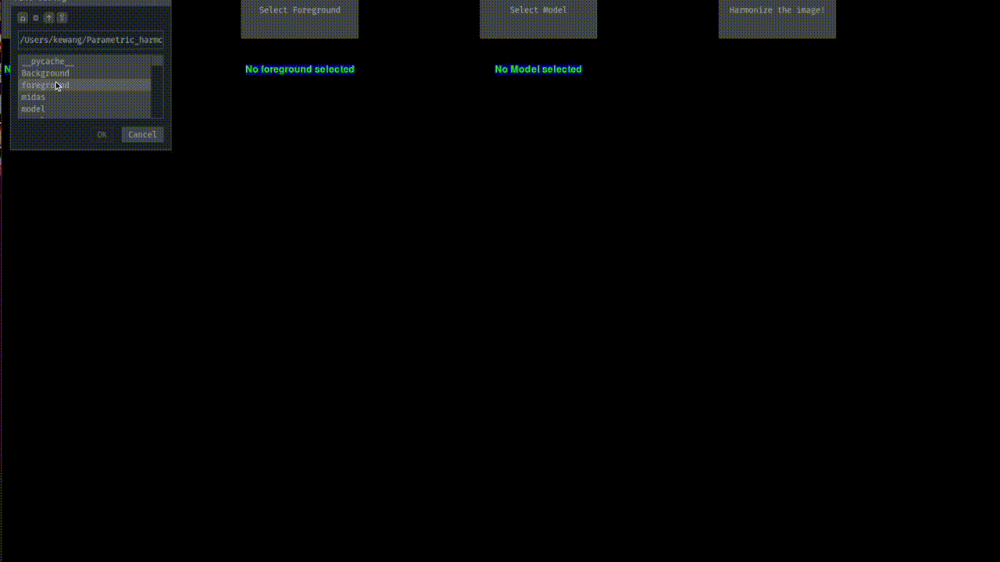

# Parametric Image Harmonization (PIH)
[Project Page](http://people.eecs.berkeley.edu/~kewang/sprih/) | [Paper](https://arxiv.org/abs/2303.00157) 

Semi-supervised Parametric Real-world Image Harmonization.\
_CVPR 2023_ \
[Ke Wang](people.eecs.berkeley.edu/~kewang), [Michaël Gharbi](http://mgharbi.com/), [He Zhang](https://sites.google.com/site/hezhangsprinter/), [Zhihao Xia](https://likesum.github.io/), [Eli Shechtman](https://research.adobe.com/person/eli-shechtman/)


**A novel semi-supervised training strategy and the first harmonization method that learns complex local appearance harmonization from unpaired real composites.**

The code was developed by [Ke Wang](people.eecs.berkeley.edu/~kewang) when Ke was a research scientist intern at Adobe research.

Please contact Ke (kewang@adobe.com or kewang@berkeley.edu) or Michaël (mgharbi@adobe.com) if you have any question.

**Results**


Our results show better visual agreements with the ground truth compared to SOTA methods in terms of color harmonization
(rows 1,2 and 4) and shading correction (row 3).



RGB curves harmonize the global color/tone (center), while our shading map corrects the local shading in the harmonization output (right).


---

## Prerequisites

- Linux
- Python 3
- NVIDIA GPU + CUDA CuDNN
- [Conda](https://docs.conda.io/en/latest/) installed


---

**Table of Contents:**<br>
1. [Setup](#setup) - set up the enviroment<br>
2. [Pretrained Models](#setup) - download pretrained models and resources<br>
3. [Interavtive Demo](#demo) - off-line interactive demo<br>
4. [Inference](#inference) - inference on high-resolution images with pretrained model<br>
5. [Dataset](#dataset) - prepare your own dataset for the training<br>
6. [Training](#training) - pipeline for training PIH<br>
7. [Citation](#citation) - bibtex citation<br>


---

## Setup

- Clone this repo:

```bash
git clone https://git.azr.adobeitc.com/mgharbi/PIH
```

- Install dependencies

We create a `environment.yml` to install the dependencies, you need to have [Conda](https://docs.conda.io/en/latest/) installed. Run

```
conda env create -f environment.yml
```
(essentially install [PyTorch](https://pytorch.org/))

---

## Pretrained models

We provide our pre-trained model (93M parameters) on *Artist Retouched Dataset* from this [link](https://adobe-my.sharepoint.com/:u:/p/kewang/EWx38imIw2NCqYHsWqlRjoYBjyQueSfCpnWsMphBqUuqng?e=vAgnb0) and put it in the folder.

```
./pretrained/
```

**Besides the model reported in the paper, we also provide a light-weight model (6M parameters), available at [link](https://adobe-my.sharepoint.com/personal/kewang_adobe_com/_layouts/15/onedrive.aspx?id=%2Fpersonal%2Fkewang%5Fadobe%5Fcom%2FDocuments%2FPIH%5Fcheckpoints&ga=1)**


---

## Demo

We provide an interavtive demo host offline built with [PyGame](https://www.pygame.org/news)

First, we install the dependencies:

```
python -m pip install -U pygame --user
pip install pygame_gui
pip install timm
```

Then, simpy run the following command to start the demo:
```
python demo.py
```

replace `demo.py` with `demo_light.py` to run on the light models.

Here we provide a tutorial video for the demo.



---

## Inference

We provide the inference code for evaluations:

```
python inference.py --bg <background dir *.png> --fg <foreground dir *.png> --checkpoints <checkpoint dir> [--gpu] [--light]
```

notes:
- arguments `--gpu` enable inference on GPU using cuda, default is by using CPU.
- arguments `--checkpoints` specifies the dir for the checkpoint.
- arguments `--light`, if specified, will do the inference using light model.


Example:

large model:
```
python inference.py --bg Demo_hr/Real_09_bg.jpg --fg Demo_hr/Real_09_fg.png --checkpoints pretrained/ckpt_g39.pth --gpu
```
light model:
```
python inference.py --bg Demo_hr/Real_09_bg.jpg --fg Demo_hr/Real_09_fg.png --checkpoints pretrained/ckpt_light_2.pth --gpu --light
```

---

## Dataset


We prepare a guidline of preparing *Artist Retouched Dataset*.

For image with name `<image-name>`, we organize the `data` directory like this:

```
data
  |--train
    |--bg
        |-- <image-name>_before.png
        |-- <image-name>_after.png
    |--masks
        |-- <image-name>_before.png
        |-- <image-name>_after.png
    |--real_images
        |-- <image-name>_before.png
        |-- <image-name>_after.png
    
  |--test
    |--bg
        |-- <image-name>_before.png
        |-- <image-name>_after.png
    |--masks
        |-- <image-name>_before.png
        |-- <image-name>_after.png
    |--real_images
        |-- <image-name>_before.png
        |-- <image-name>_after.png
```

notes:
- bg (background): Inpainted background using foreground masks. Here we use [LAMA](https://github.com/advimman/lama) to perform inpainting.
- masks: Foreground masks, should be consistent between `Before`, and `After`.
- real_images: Ground truth real images.

---

## Training

Our approach uses a dual-stream semi-supervised training to bridge the domain gap, alleviating the generalization issues that plague many state-of-the-art harmonization models


We provide the script `train_example.sh` to perform training, and script `train_example_lightmodel.sh` for training light models.

Training notes:
- modify `--dir_data` to the path of your custum dataset.
- arguments `recon_weight` correspons to the weighting parameter to balance stream 1 and stream 2.

Simply run:
```
bash scrits/train_example.sh
```
to start the training.

---

## Citation
If you use this code for your research, please cite our paper.

```
@article{wang2023semi,
  title={Semi-supervised Parametric Real-world Image Harmonization},
  author={Wang, Ke and Gharbi, Micha{\"e}l and Zhang, He and Xia, Zhihao and Shechtman, Eli},
  booktitle = {Proceedings of the IEEE/CVF Conference on Computer Vision and Pattern Recognition (CVPR)},
  year      = {2023}
}

